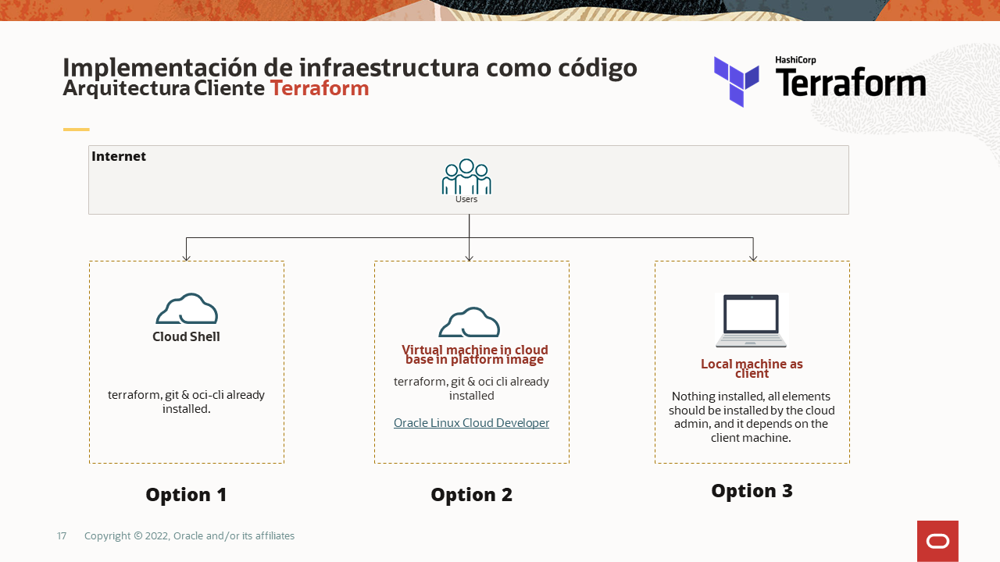

---
# Welcome to OCI-INLAB laboratories
This repository contains Terraform code to deploy an IaC basic architecture divided in 2 labs (lab-01 and lab-02), but if if you are looking for more advanced excersises, maybe will be useful you
can check the [Oracle Architecture Center](https://docs.oracle.com/solutions/?q=terraform&cType=reference-architectures&sort=date-desc&lang=en).

## Prerequisites to execute terraform to prepare the LAB-01 (OCI-INLAB) and LAB-02 (Resource Manager):
On your must have the following points covered in order to perform the LAB-01 (OCI-INLAB):
* You must have a Oracle Cloud Infrastructure (OCI) subscription (Free Account or paid Account), and with the subscription you must have a user account with enough privileges to deploy infrastructure with Terraform.
* Define [API Keys](https://docs.oracle.com/en-us/iaas/Content/API/Concepts/apisigningkey.htm) for each user (cloud account assigned) to perform terraform deployments, also it's going to be needed the OCIDs information from:
  - Tenancy OCID
  - User OCID
  - Compartment OCID
  - Availability Domain name
  - Fingerprint
  - Region Name
  - SSH pair key   
* Consider the terraform binary file for your operating system, for the lab and operative environments ee recommend use terraform >= 0.12.20 or greater.
* SSH Client accordingly [Way to install/use terraform options](#ways-to-use-install-or-install-terraform-client) 


## Ways to use or install terraform client
Option to use or install terraform:


Consider the lab can be performed base in 3 different options:
* **Option 1 - Use terraform with [Cloud Shell](https://docs.oracle.com/en-us/iaas/Content/API/Concepts/cloudshellintro.htm)**: it is a web browser-based terminal accessible from the Oracle Cloud Console. 
* **Option 2 - Virtual Machine in cloud**: Install terraform cli and components (it, oci-cli, etc.) enabiling repos.
* **Option 3 - Cloud Development Kit**: The Terraform provider is pre-installed on the [Oracle Linux Cloud Developer](https://docs.oracle.com/en-us/iaas/oracle-linux/developer/index.htm) platform image. The Oracle Cloud Development Kit includes Terraform and the OCI Terraform provider, and preconfigures the required authorization.

### Option 1: Use terraform with Cloud Shell 
Cloud Shell is free to use (within monthly tenancy limits), and provides access to a Linux shell, with a pre-authenticated Oracle Cloud Infrastructure CLI, a pre-authenticated Ansible installation, and other useful tools for following Oracle Cloud Infrastructure service tutorials and labs. Cloud Shell is a feature available to all OCI users:
- It is accessible from the OCI Console
- An ephemeral machine to use as a host for a Linux shell, pre-configured with the latest version of the OCI Command Line Interface (CLI) and a number of useful tools
- 5GB of storage for your home directory
- A persistent frame of the Console which stays active as you navigate to different pages of the console

You start Cloud Shell from your OCI Console.
 
### Option 2: Virtual machine in cloud
For this case the cloud admin should install several components related with IaS deployment with terraform:

* Install developer repository based in the latest image platform version available (not OL9):
```
$sudo dnf -y install oraclelinux-developer-release-el8
```
```
$sudo yum-config-manager --enable ol8_developer
```
* Install OCI client [Consider configure previusly oci-cli to corroborate interaction with OCI Cloud](https://docs.oracle.com/en-us/iaas/Content/API/Concepts/cliconcepts.htm)
```
$sudo dnf install python36-oci-cli
```

* Install git utility to manage code projects:
```
$sudo yum install git
```

* Install terraform client:
```
$sudo yum install terraform
```
* Install terraform provider:
```
$sudo yum install terraform-provider-oci
```	
* Test terraform installation opening a terminal window and run the following command to test your installation:
```
$terraform -v
```

### Option 3: Install Oracle Cloud Developer
This third option, you can install [Oracle Linux Cloud Developer](https://docs.oracle.com/en-us/iaas/oracle-linux/developer/index.htm) platform image from OCI consol instance subsection, or you can use [Resource Manager](https://docs.oracle.com/en-us/iaas/Content/ResourceManager/Tasks/devtools.htm) to preinstall this distro within your compartment. 

# LAB-01 (OCI-INLAB) Basic deployment architecture
For the LAB-01 the components can be depicted as follow:


Access [LAB-01 (OCI-INLAB) Basic deployment architecture](https://github.com/dominusceo/oci-terraform-lab/tree/main/lab-01)

# LAB-02 Basic Deployment with OCI Resource Manager
For the LAB-02 the components can be depicted as follow:


Access [LAB-02 Basic Deployment with OCI Resource Manager](https://github.com/dominusceo/oci-terraform-lab/tree/main/lab-02)
## Let's get started, clone the repository from Github
Clone the git project from the client that you are going to perform the lab:
```
$git clone https://github.com/dominusceo/oci-terraform-lab.git
```
## Other considerations
For this lab consider the following points:
- The **tfVariables.sh** script contains default global variables to be defined or used with Terraform client.
- Take a look to our [Oracle Architecture Center](https://docs.oracle.com/solutions/?q=terraform&cType=reference-architectures&sort=date-desc&lang=en)
- You can take this PDF document in order to take it as reference as [guide to install Terraform in windows client](choco_install-terraform.pdf)
