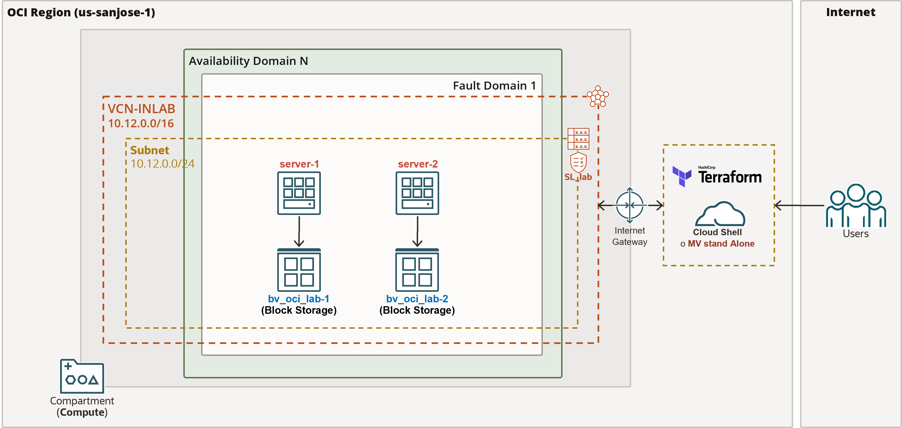

---
# Welcome to OCI-INLAB laboratory (Performing Terraform infrastructure demo)
This repository contains Terraform code to deploy an IaC basic architecture
if you are looking for more advanced excersises, maybe will be useful you
can check the Oracle Architecture Center [here]().

## Prerequisites to execute terraform to prepare the OCI-INLAB
On your must have the following points covered in order to perform the OCI-INLAB:
* You must have a Oracle Cloud Infrastructure (OCI) subscription (Free Account or paid Account), and with the subscription you must have a user account with enough privileges to deploy infrastructure with Terraform.
* Define API Keys for each user (cloud account assigned) to perform terraform deployments, also it's going to be needed the OCIDs information from:
  - Tenancy OCID
  - User OCID
  - Compartment OCID
  - Availability Domain name
  - Region Name
  - SSH pair key   
* The correct Terraform binary file for your operating system. We recommend using Terraform >= 0.12.20 or greater.
* SSH client
* Developer repository install and enablement for OL8:
```
$sudo dnf -y install oraclelinux-developer-release-el8
```
```
$sudo yum-config-manager --enable ol8_developer
```
* OCI client [Consider configure previusly oci-cli to corroborate interaction with OCI Cloud](https://docs.oracle.com/en-us/iaas/Content/API/Concepts/cliconcepts.htm)
```
$sudo dnf install python36-oci-cli
```
* Install git utility
```
$sudo yum install git
```
	
## Ways to use/install terraform
Consider the lab can be performed base in 3 different options:
* **Option 1 - Use terraform from [Cloud Shell](https://docs.oracle.com/en-us/iaas/Content/API/Concepts/cloudshellintro.htm)**: it is is a web browser-based terminal accessible from the Oracle Cloud Console. 
* **Option 2 - Install terraform cli and provider enabiling repos.
* **Option 3 - Cloud Development Kit**: The Terraform provider is pre-installed on the [Oracle Linux Cloud Developer](https://docs.oracle.com/en-us/iaas/oracle-linux/developer/index.htm) platform image. The Oracle Cloud Development Kit includes Terraform and the OCI Terraform provider, and preconfigures the required authorization.

### Option 1: Use terraform with Cloud shell 
Cloud Shell is free to use (within monthly tenancy limits), and provides access to a Linux shell, with a pre-authenticated Oracle Cloud Infrastructure CLI, a pre-authenticated Ansible installation, and other useful tools for following Oracle Cloud Infrastructure service tutorials and labs. Cloud Shell is a feature available to all OCI users, accessible from the Console.  
Cloud Shell provides:
- An ephemeral machine to use as a host for a Linux shell, pre-configured with the latest version of the OCI Command Line Interface (CLI) and a number of useful tools
- 5GB of storage for your home directory
- A persistent frame of the Console which stays active as you navigate to different pages of the console

### Option 2: Install terraform and provider enabling apropiate repositories in simpl virtual machine
If you require install terraform client withih a virtual machine, you should consider the Operating System Version, here provides the enablement for Oracle Linux repositories accordingly with OL version:

* Cosider enable the appropiate repositories:
  - For OL7:
``` 
$sudo yum-config-manager --enable ol7_developer
```
  - For OL8:
```
$sudo yum-config-manager --enable ol8_developer

```
* Installing terraform package:
```
$sudo yum install terraform
```
* Install terraform provider by running the following yum command from an Oracle Linux machine:
```
$sudo yum install terraform-provider-oci
```	
* Test the Terraform Installation opening a terminal window and run the following command to test your installation:
```
$terraform -v
```
## Option 3: Install Oracle Cloud Developer
Besides you can perform [Oracle Linux Cloud Developer](https://docs.oracle.com/en-us/iaas/oracle-linux/developer/index.htm) platform image from OCI consol instance subsection, you can use [Resource Manager](https://docs.oracle.com/en-us/iaas/Content/ResourceManager/Tasks/devtools.htm) to preinstall the Oracle Cloud Development Kit on a compute instance in your compartment. 


# Lab OCI-INLAB architecture
The lab components can be depicted as follow:


## Clone the repository from Github
Clone the git project from the client that you are going to perform the lab:
```
$git clone https://github.com/dominusceo/oci-terraform-lab.git
```
## Other considerations
For this lab consider the following points:
- The **tfVariables.sh** script contains default global variables to be defined or used with Terraform client.
- Take a look to our [Oracle Architecture Center](https://docs.oracle.com/solutions/?q=terraform&cType=reference-architectures&sort=date-desc&lang=en)
