---
# LAB-01 - OCI-INLAB laboratory
For this lab, you can take the following architecture as reference, also you should consider 
can check the [Oracle Architecture Center](https://docs.oracle.com/solutions/?q=terraform&cType=reference-architectures&sort=date-desc&lang=en) for more advanced examples of architectures to use through terraform.

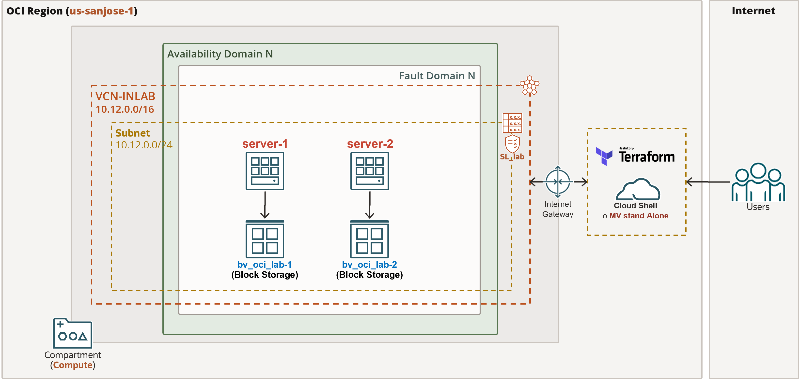

## LAB-01 #1 - VCN, route tables and subnet related creation
Elements to create:
1. Create VCN 
2. Create subnet
3. Internet Gateway creation and route table associated
4. Link the routable created with the subnet created

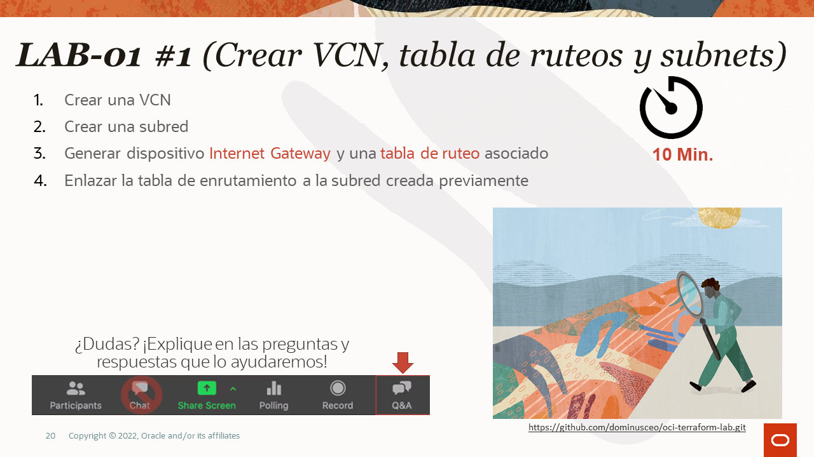
To perform the above steps, open a terminal accordingly with your installation terraform client and execute:
```bash
cd $HOME/oci-terraform-lab/lab-01
$terraform init
$terraform apply
```
Once you approve the plan, you will see something similar to the following output:
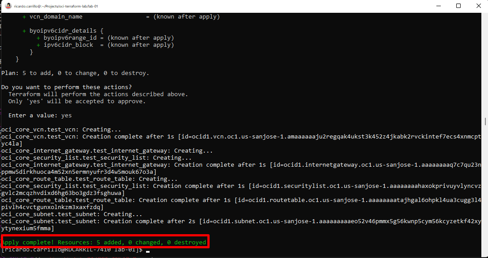
Please, validate within the OCI console.

## LAB-01 #2 - Instance creation
In this step you will create:
1. 2 instances, considering each instance has a different name (Ex: **server-1** y **server-2**)
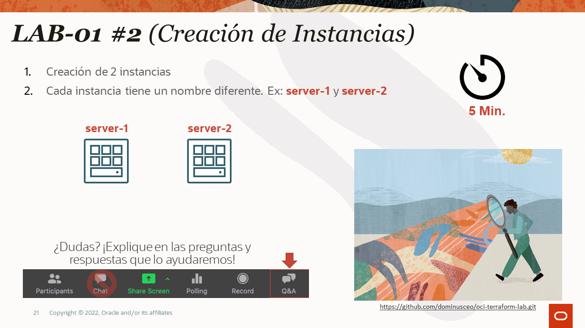

Rename the file from  **compute.tf** file  to **compute.tf** and perform apply operation again with terraform client:
```bash
cd $HOME/oci-terraform-lab/lab-01
$mv compute.tf_ compute.tf 
$terraform apply
```

Once you approve the plan, you will see something similar to the following output:


Please, validate within the OCI console.

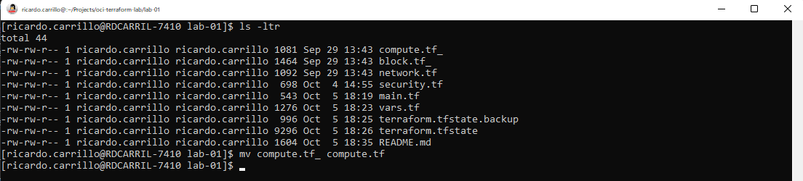
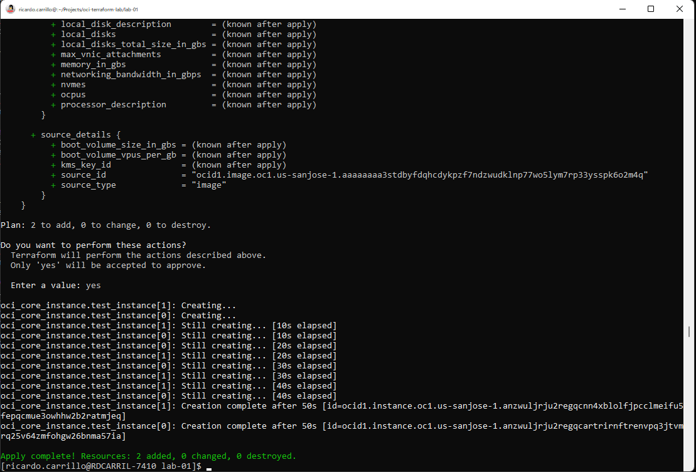
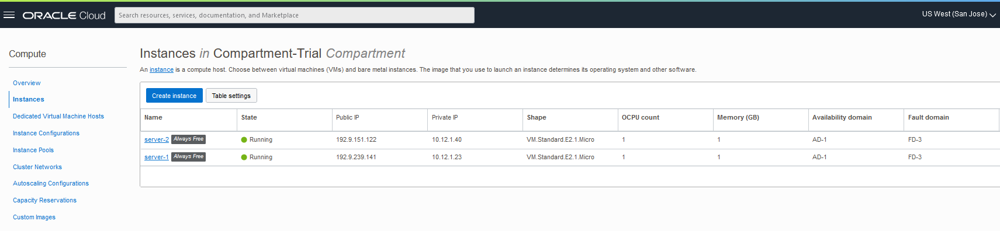

## LAB-01 #3 - Security Lists creation
1. Create 3 ingress rules within the security list recently created: 
- TCP 22 port, TCP protocol (SSH Access)
- TCP 8080 port, TCP protocol (Proxy Web – **NOT DEPLOYED**)
- TCP 3620 port, TCP protocol (iSCSI connectivity)

2.  Egress rule creation 
- 0.0.0.0/0 segment (All internet) 
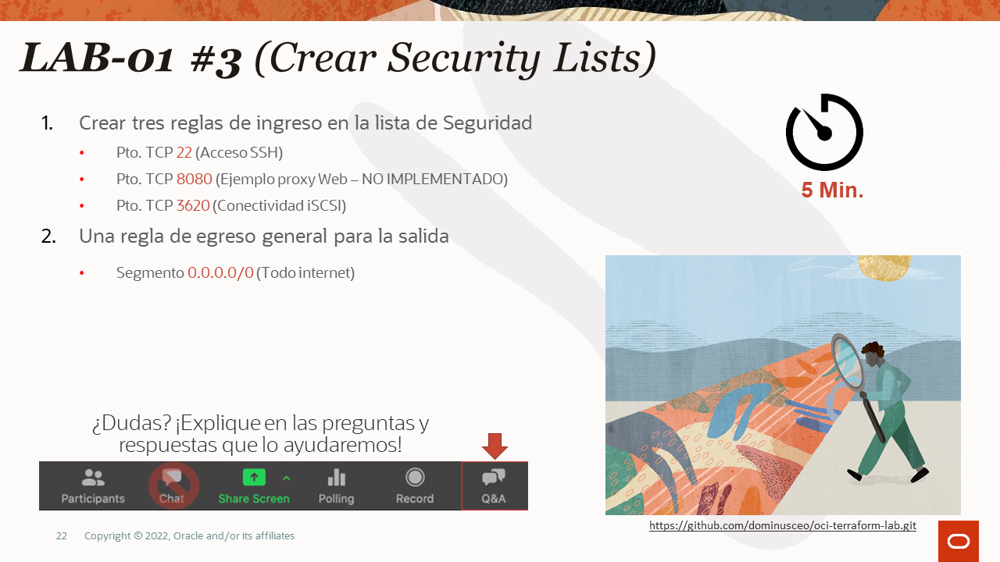

Edit the file from  **security.tf file** and remove comments marks from line 6 and 40:
```bash
     1  resource "oci_core_security_list" "test_security_list" {
     2    compartment_id = var.compartment
     3    vcn_id         = oci_core_vcn.test_vcn.id
     4    display_name   = "SL_lab"
     5
     6    /*
     7    egress_security_rules {
     8      destination = "0.0.0.0/0"
     9      protocol    = "all"
    10    }
    11
    12  // Commented for lab #3
    13
    14    ingress_security_rules {
    15      protocol = "6"
    16      source   = "0.0.0.0/0"
    17      tcp_options {
    18        min = "22"
    19        max = "22"
    20      }
    21    }
    22
    23    ingress_security_rules {
    24      protocol = "6"
    25      source   = "0.0.0.0/0"
    26      tcp_options {
    27        min = "8080"
    28        max = "8080"
    29      }
    30    }
    31
    32    ingress_security_rules {
    33      protocol = "6"
    34      source   = "0.0.0.0/0"
    35      tcp_options {
    36        min = "3620"
    37        max = "3620"
    38      }
    39    }
    40  */
    41  }
```
Save the **security.tf** file and perform terraform execution plan:
```bash
cd $HOME/oci-terraform-lab/lab-01
$terraform apply
```
Once you have made these moditications, you will see somethin such as:

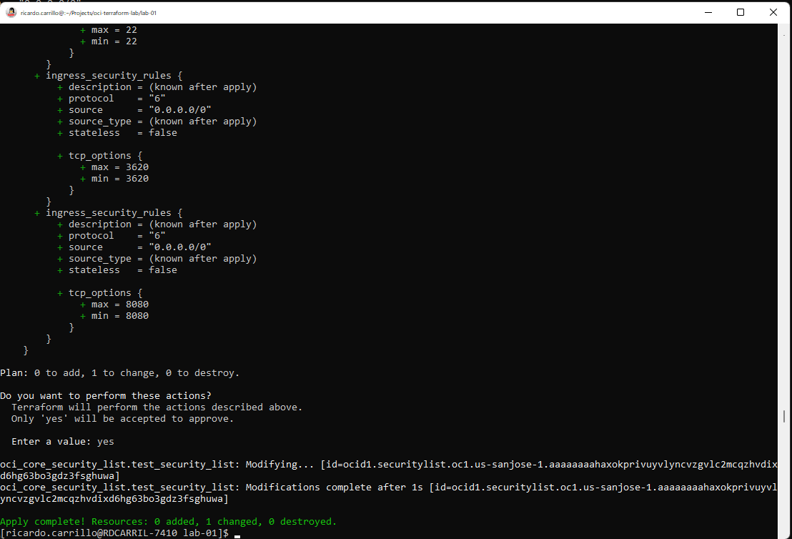
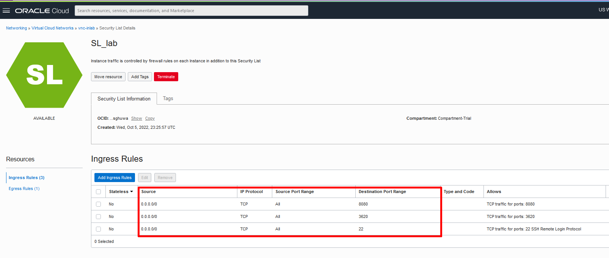
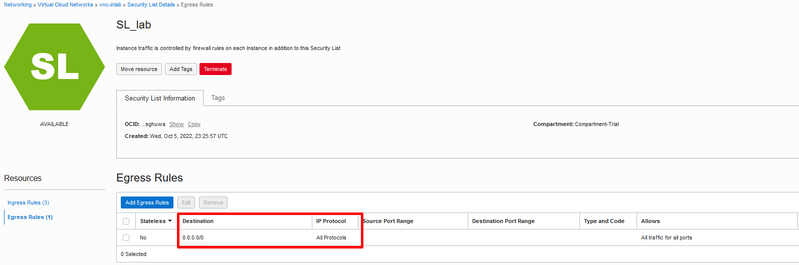

## LAB-01 #4 - Adjuntar Block Volume
Attach 2 block volumes to both instances through iSCSI protocol.


Rename the file from  **bash block.tf_** file  to **block.tf** and perform apply operation again with terraform client:
```bash
cd $HOME/oci-terraform-lab/lab-01
$mv block_.tf_ block.tf
$terraform apply
```
Once performed the terraform apply, you can see something such as:

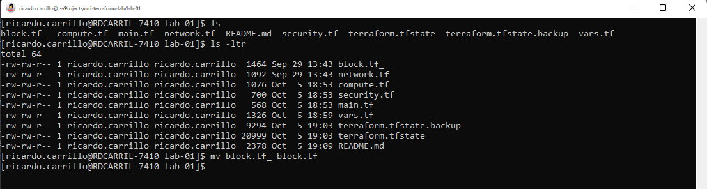
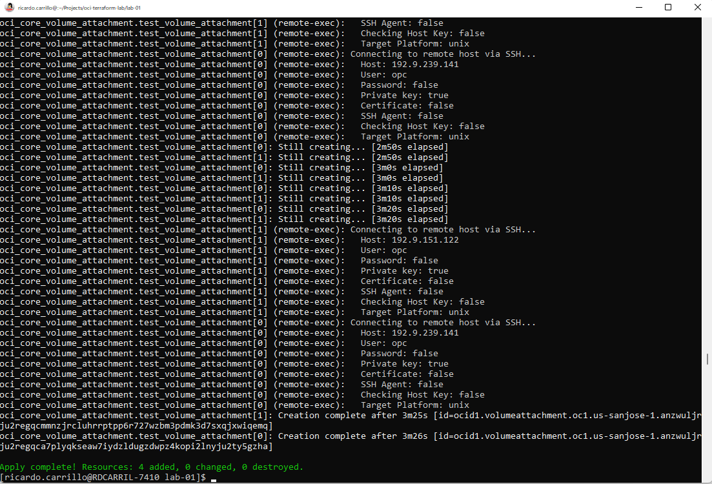
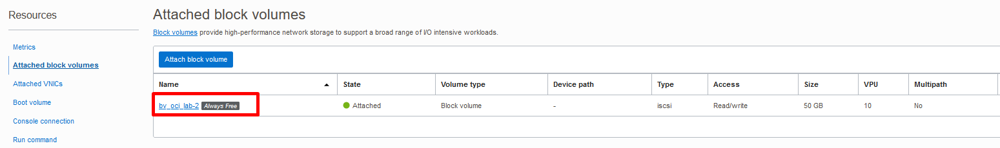

# Reseting LAB-01 
In order to perform a 'clean up' to this LAB, please perform the following execution:
```bash
$terraform destroy -auto-approve
```
Once terraform has performed destroy operation, you should see something like this:

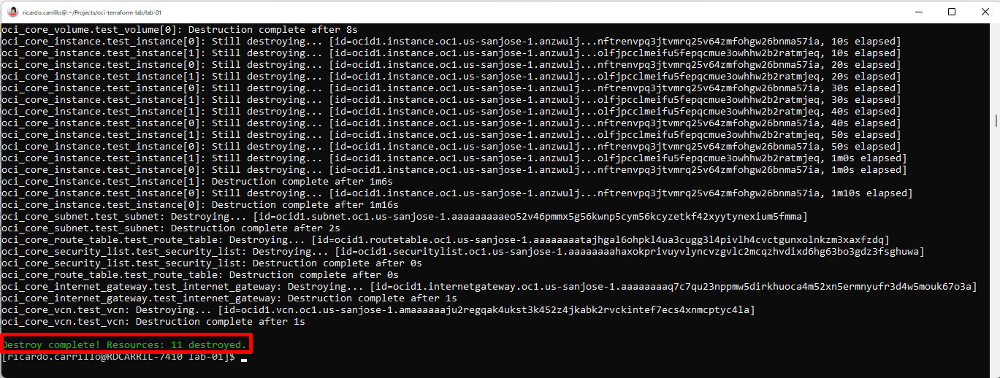
