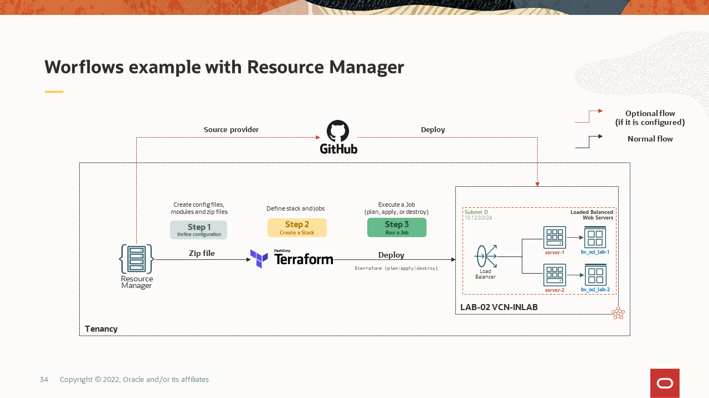

---
# LAB-02 - OCI-INLAB laboratory
For this you should consider delete ```$terraform destroy``` **LAB-01**. 

Elements to create:
1. Create VCN 
2. Create subnet
3. Internet Gateway creation and route table associated
4. Link the routable created with the subnet created
5. 2 instances creation
6. Each instance has a different name, Ex: **server-1** y **server-2**
7. Create 3 ingress rules within the security list recently created:
   - TCP 22 port, TCP protocol (SSH Access)
   - TCP 8080 port, TCP protocol (Proxy Web – **NOT DEPLOYED**)
   - TCP 3620 port, TCP protocol (iSCSI connectivity)
8.  Egress rule creation
   - 0.0.0.0/0 segment (All internet)
9. Attach 2 block volumes to both instances through iSCSI protocol.


