---
# LAB-02 - OCI-INLAB laboratory
For this you should consider delete in LAB-01. 
```bash 
$terraform destroy
```
## Architecture LAB-02
The following is a diagram reference from the lab:


## Elements to create:
This lab, will be perform the following objects creation:
1. Create VCN 
2. Create subnet
3. Internet Gateway creation and route table associated
4. Link the routable created with the subnet created
5. 2 instances creation
6. Each instance has a different name, Ex: **server-1** y **server-2**
7. Create 3 ingress rules within the security list recently created:
   - TCP 22 port, TCP protocol (SSH Access)
   - TCP 8080 port, TCP protocol (Proxy Web – **NOT DEPLOYED**)
   - TCP 3620 port, TCP protocol (iSCSI connectivity)
8. Egress rule creation
   - 0.0.0.0/0 segment (All internet)
9. Attach 2 block volumes to both instances through iSCSI protocol.


## LAB-02 #1
1. Create and save the zip file within your local machine:
```bash 
$zip -r ~/Downloads/lab-02-rm.zip lab-02/
  adding: lab-02/ (stored 0%)
  adding: lab-02/tfVariables.sh (deflated 46%)
  adding: lab-02/load_balancer.tf (deflated 70%)
  adding: lab-02/block.tf (deflated 60%)
  adding: lab-02/tf-private.key (deflated 23%)
  adding: lab-02/compute.tf (deflated 33%)
  adding: lab-02/README.md (deflated 42%)
  adding: lab-02/vars.tf (deflated 54%)
  adding: lab-02/main.tf (deflated 43%)
  adding: lab-02/security.tf (deflated 74%)
  adding: lab-02/certificates/ (stored 0%)
  adding: lab-02/certificates/loadbalancer.crt (deflated 29%)
  adding: lab-02/certificates/create-certificates.sh (deflated 56%)
  adding: lab-02/certificates/ca.key (deflated 23%)
  adding: lab-02/certificates/loadbalancer.key (deflated 23%)
  adding: lab-02/certificates/loadbalancer.csr (deflated 27%)
  adding: lab-02/certificates/ca.srl (stored 0%)
  adding: lab-02/certificates/ca.crt (deflated 30%)
  adding: lab-02/certificates/ca.csr (deflated 27%)
  adding: lab-02/certificates/EXAMPLE.cnf (deflated 50%)
  adding: lab-02/lb_full-example-base.tf_ (deflated 78%)
  adding: lab-02/network.tf (deflated 75%)
$
```
2. Once created the zip file, log-in in your OCI Console and go to **hamburguer menu > Developer Services > Resource Manager**:
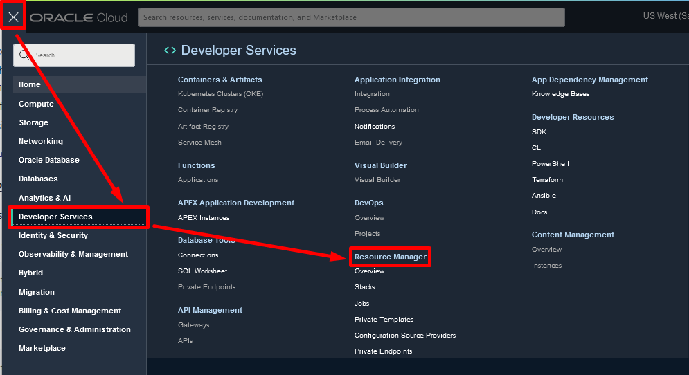
- Create an stack:
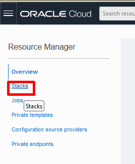

- Select My configuration and **Zip file** option:
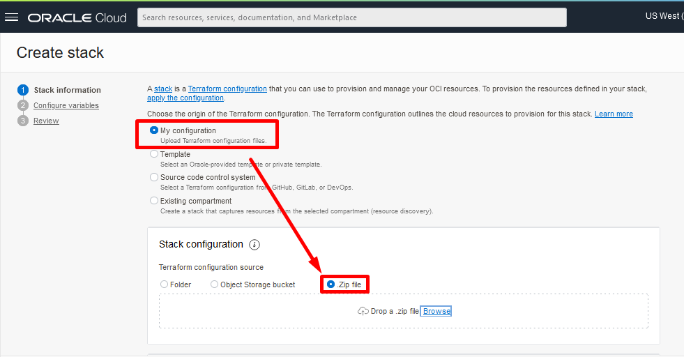
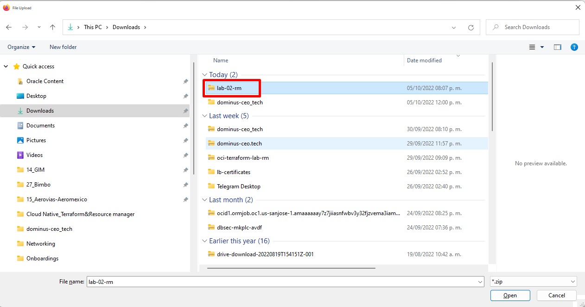
- Once you have selected Zip file options, clic on browse and select the file **lab-02.zip** and see the result:
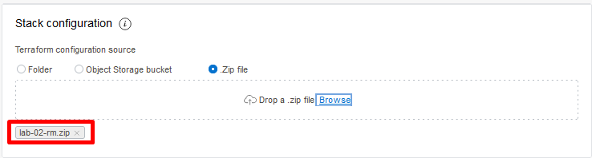
- Keep Custom providers as default, and set the following inputs in each field:
   - Name: lab-02-rm
   - Description: Terraform lab-02-rm
   - Terraform version: 0.13.x

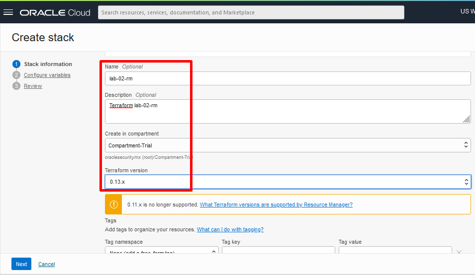

- Clic on Next button

3. You will see automatically is loaded info related with the file **vars.tf** and clic on Next button:
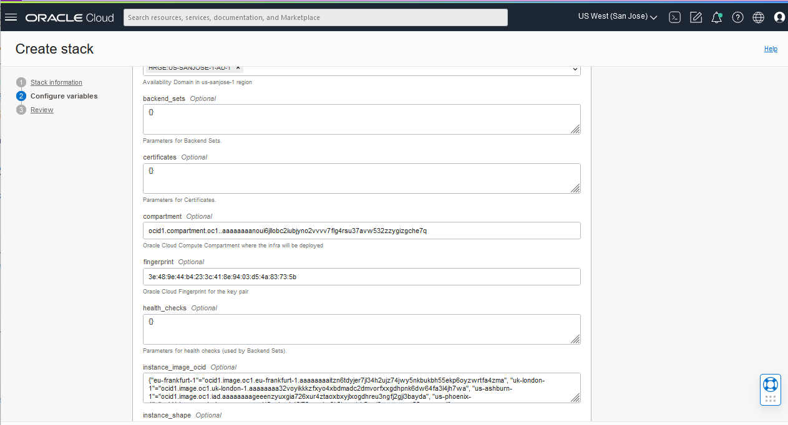

4. In Review phase, just clic create button:
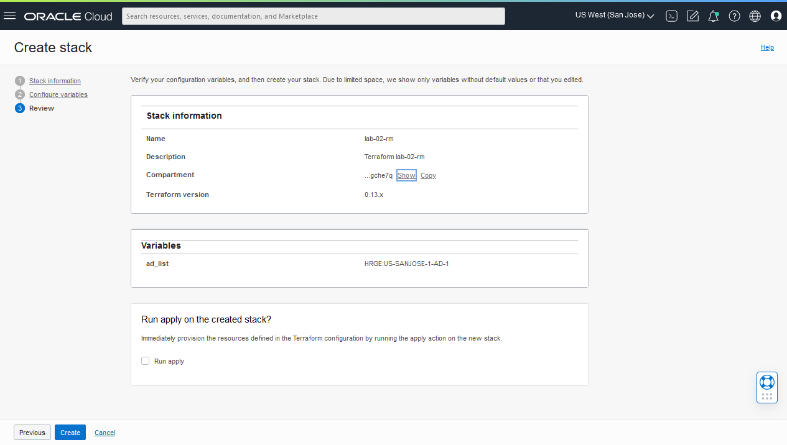

5. The Stack **lab-02-rm** has been created we proceed to create a plan:
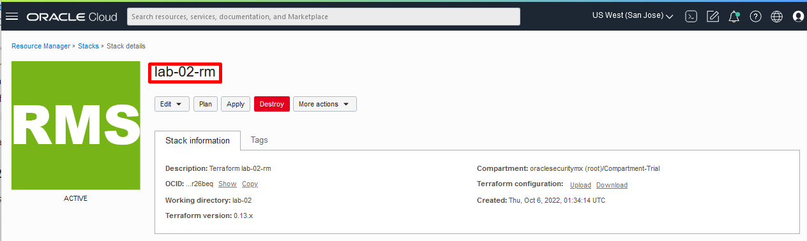

- Clic in plan button, and provide the name **plan-job-lab-02-rm** within the text field and clic **Plan** button:

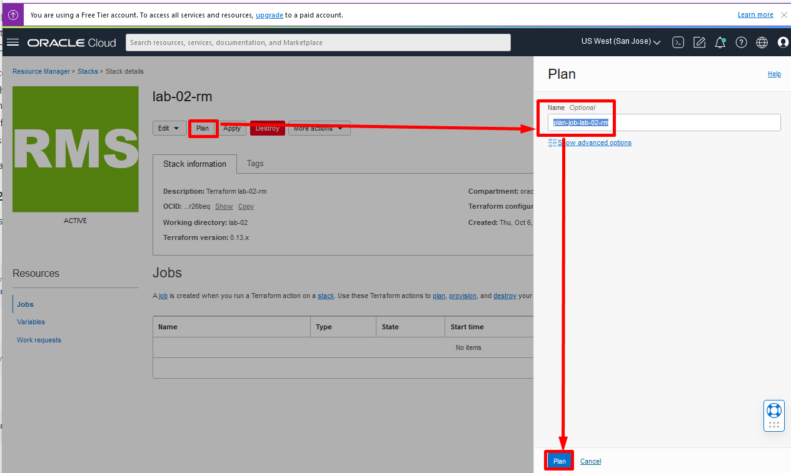
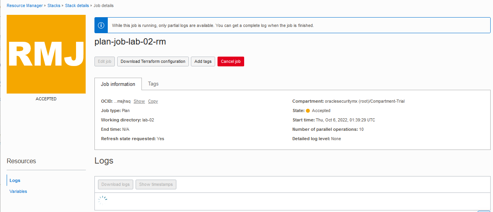
- We can see the **Plan** has been executed successfully:
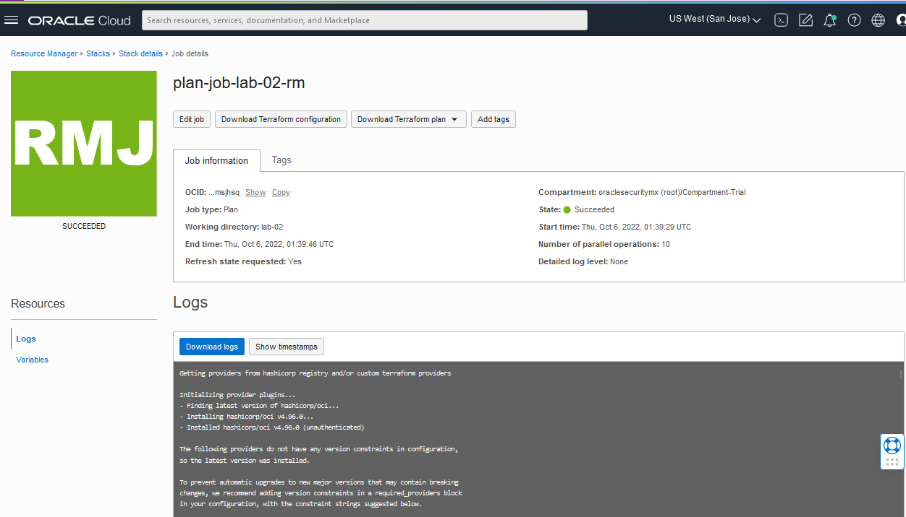

6. We go to Stack details, clic on **Apply** button, and set the following info:
- Name: apply-job-02-rm
- Apply job plan resolution: **select default plan job listed**
- Once, we clic on blue **Apply** button
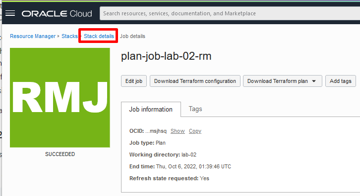
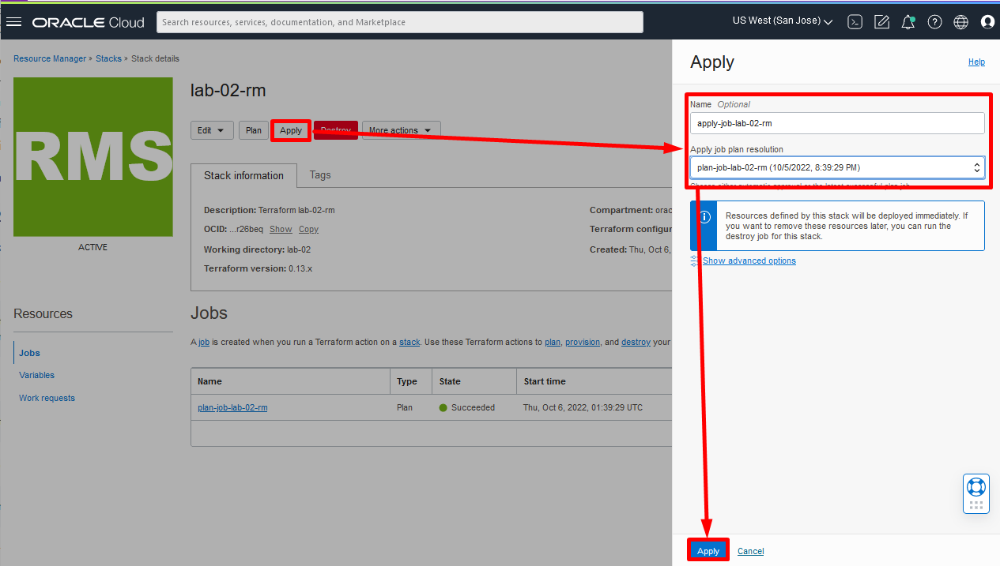

7. Once peformed the plan, we can see the progress and the success:

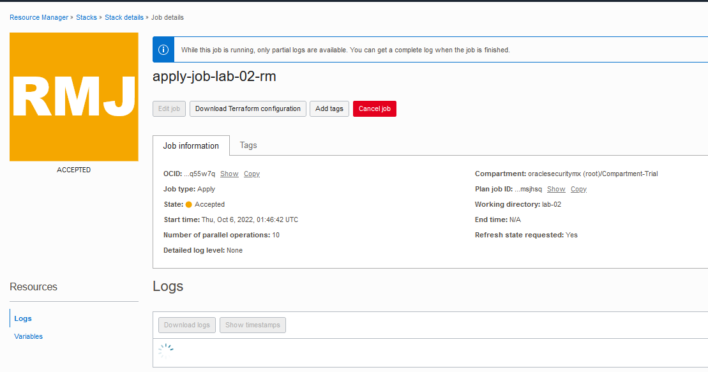
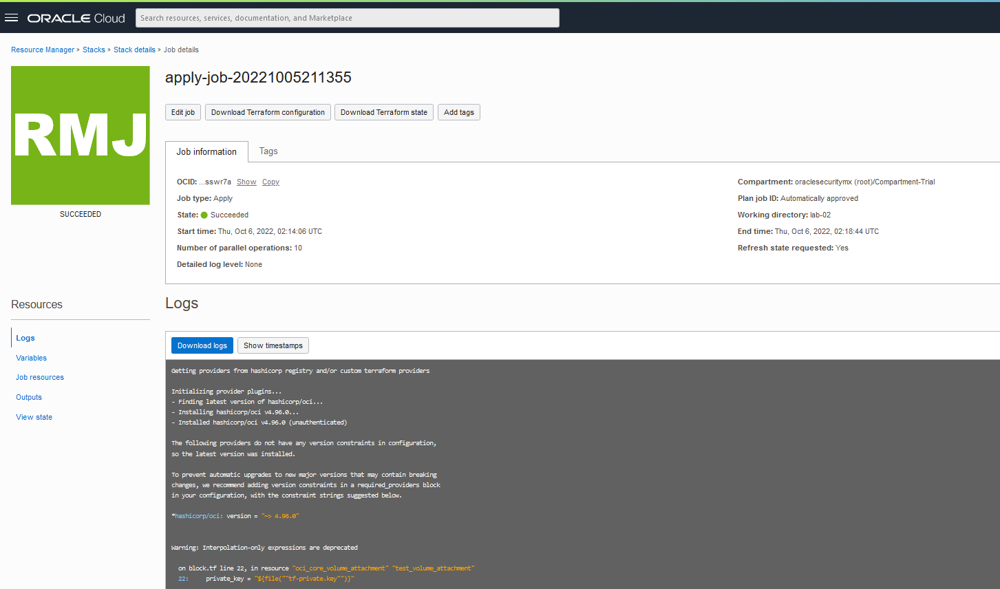

